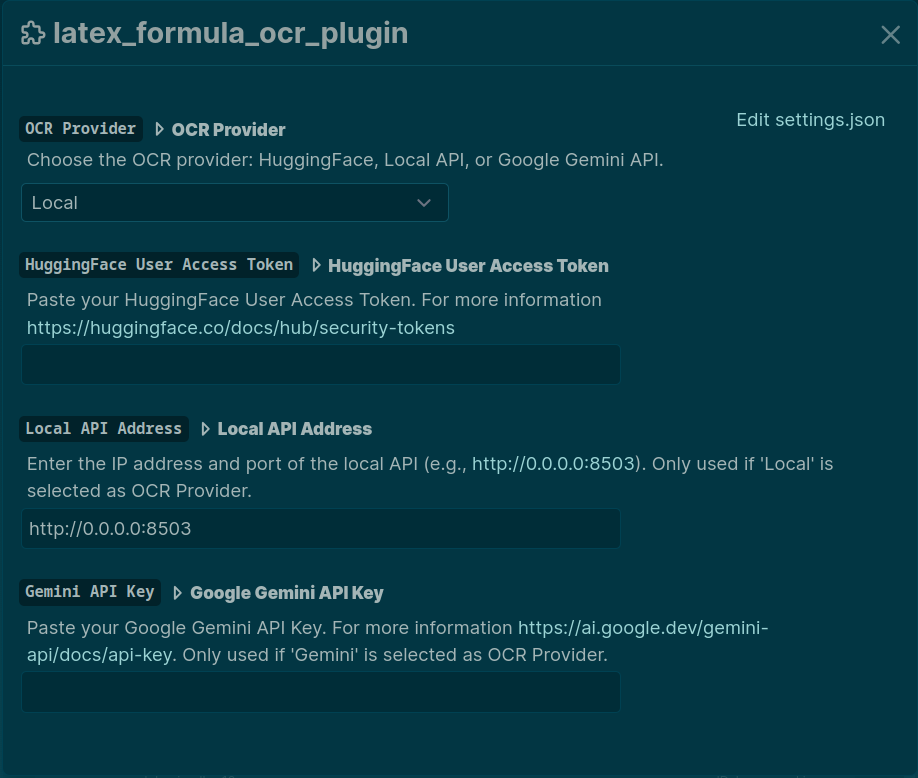

> **Note**: This update includes support for Google Gemini and the local `pix2text` server, instructions for starting the server, and details about the new settings options. 


# Logseq LaTeX Formula OCR Plugin

Convert LaTeX formula images from clipboard to LaTeX code in [Logseq](https://logseq.com/) using various OCR providers like Hugging Face Transformers, Google Gemini, or a local Pix2Text server.

**Use cases:**

- Preparation of scientific presentations or papers
- Transcribing lectures
- Technical reports
- Self-study

(For me it was useful because I hate copying formulas by hand and I hate pasting screenshots of formulas into Logseq😅)

## Commands

- `/display-formula-ocr`: Insert LaTeX code on a new line
- `/inline-formula-ocr`: Insert LaTeX code within a paragraph
- `/table-ocr`: Insert a Markdown table from an image. Currently works best with the Gemini provider.

> **Notes**: 
> + The image in the clipboard must be a LaTex formula image
> + Initial use may be slow due to model loading
> + With the free Hugging Face plan you can make about 30k calls per month
> + The Google Gemini API has a free tier with usage limits. Check the [official pricing page](https://ai.google.dev/pricing) for details.


## Installation Options

1. **Manual + Hugging Face**
    - Requirements: [Node.js](https://nodejs.org/en), [Yarn](https://yarnpkg.com/), [Parcel](https://parceljs.org/), [Hugging Face User Access Token](https://huggingface.co/docs/hub/security-tokens)
   - Clone repo: `git clone https://github.com/olmobaldoni/logseq-formula-ocr-plugin.git`
   - Install dependencies: `cd logseq-formula-ocr-plugin && yarn && yarn build`
   - Enable developer mode: `Logseq > Settings > Advanced > Developer mode`
   - Import Plugin: `Logseq > Plugins > Load unpacked plugin` and point to the cloned repo

2. **Marketplace + Hugging Face**
   - Requirements: [Hugging Face User Access Token](https://huggingface.co/docs/hub/security-tokens)
   - Search for `LaTeX Formula OCR` in the Logseq marketplace and install directly

3. **Marketplace + Docker**
    - Requirements: [Docker](https://www.docker.com/)
    - Search for `LaTeX Formula OCR` in the Logseq marketplace and install directly
    - Pull image: `docker pull olmobaldoni/nougat-ocr-api:latest`
    - Run container: `docker run -d -p 80:80 olmobaldoni/nougat-ocr-api:latest`

4. **Manual + Gemini**
    - Requirements: Google Gemini API Key
    - Enable developer mode: `Logseq > Settings > Advanced > Developer mode`
    - Import Plugin: `Logseq > Plugins > Load unpacked plugin` and point to the cloned repo
    - Go to plugin settings, select "Gemini" as the OCR Provider.
    - Paste your Google Gemini API Key in the corresponding setting field.

5. **Manual + Pix2Text (Offline)**
   - Install Pix2Text [Python package](https://github.com/breezedeus/pix2text?tab=readme-ov-file#install)
   - Start the server, eg. ```p2t serve -l en -H 0.0.0.0 -p 8503 ```
   - Enable developer mode: `Logseq > Settings > Advanced > Developer mode`
   - Import Plugin: `Logseq > Plugins > Load unpacked plugin` and point to the cloned repo
   - In the plugin settings, select "Local" as the OCR Provider and set the "Local API Address" to the appropriate IP address and port (default is http://0.0.0.0:8503)
 

> **Note**: For more information on how to use the other local API visit: https://github.com/olmobaldoni/LaTex-Formula-OCR-API

## Settings

1. **Hugging Face**
    - In Hugging Face: `Settings > Access Tokens > New Token > Name+Role(read) > Generate a token`
    - In Logseq: `Plugins Settings > LaTex Formula OCR > Hugging Face User Access Token` and paste the token.
    
2. **Local API**
    - In Logseq: `Plugins Settings > LaTex Formula OCR > Use Local API` to switch between Hugging Face and local

3. **Gemini API**
    - Get your API key from Google AI Studio.
    - In Logseq: `Plugins Settings > LaTex Formula OCR > OCR Provider` and select `Gemini`.
    - Then, in `Plugins Settings > LaTex Formula OCR > Google Gemini API Key` paste the token.





## Demo

- ### Demo 1


- ### Demo 2


## Known Issues

Hugging Face API may truncate responses (see [Issuee #2](https://github.com/NormXU/nougat-latex-ocr/issues/2) and [Issue #487](https://github.com/huggingface/huggingface.js/issues/487))

> **Note**: <ins> Docker or Local(Pix2Text) method recommended for full functionality </ins>

## Credits

This plugin is based on [nougat-latex-base](https://huggingface.co/Norm/nougat-latex-base), a fine-tuning of [facebook/nougat-base](https://huggingface.co/facebook/nougat-base) with [im2latex-100k](https://zenodo.org/records/56198#.V2px0jXT6eA), and made by [NormXU](https://github.com/NormXU).

[Pix2Text](https://github.com/breezedeus/pix2text): Used for the local OCR server.

[Google Gemini](https://ai.google.dev/): Used as one of the OCR providers.

In addition, this plugin was also inspired by [xxchan](https://github.com/xxchan) and its plugin [logseq-ocr](https://github.com/xxchan/logseq-ocr)


## License

MIT
